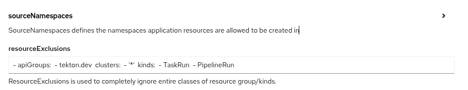

# Demo for tranforming HTTP request to Kafka events through Apache Camel

## Resources needed to run this demo

You need an OpenShift cluster. If you're a Red Hatter or a Red Hat partner, you can request an OpenShift cluster running in GCP for this demo. You can request it [here](https://catalog.demo.redhat.com/catalog?item=babylon-catalog-prod/gcp-gpte.ocp4-on-gcp.prod&utm_source=webapp&utm_medium=share-link).


## Deploying demo environment

This demo uses all the software officially provided by Red Hat. 

Next step, go to your OpenShift cluster and install the OpenShift GitOps operator. Remove the PipelineRun on the resourceExclusions parameter when you install OpenShift GitOps operator.



Once installed, create an Application object with all the information you just collected under the helm parameters section, change the cluster.domain by the obtained value. 

- Cluster domain. You need to pass the application domain of your cluster to the Helm chart to properly deploy the demo. It should be something like `apps.cluster-dqxwv.dqxwv.gcp.redhatworkshops.io`. 


```
apiVersion: argoproj.io/v1alpha1
kind: Application
metadata:
  name: rest2kafka-demo-deploy
  namespace: openshift-gitops
spec:
  destination:
    server: 'https://kubernetes.default.svc'
  project: default
  source:
    helm:
      parameters:
        - name: cluster.domain
          value: {{PUT HERE YOUR CLUSTER DOMAIN}}
        - name: demo.namespace
          value: appdev-streams
        - name: strimzi.subscriptionName
          value: strimzi-operator
        - name: strimzi.operatorGroupName
          value: strimzi-operatorgroup
        - name: datagrid.subscriptionName
          value: datagrid-operator
        - name: datagrid.operatorGroupName
          value: datagrid-operatorgroup     
    path: rest2kafka-demo-deploy
    repoURL: 'https://github.com/sgutierr/rest2kafka.git'
    targetRevision: HEAD
  syncPolicy:
    automated:
      prune: true
      selfHeal: true
    retry:
      backoff:
        duration: 10s
        factor: 2
        maxDuration: 10m
      limit: 10
    syncOptions:
      - CreateNamespace=true
```

The installation creates the streams of Kafka, kafka console, openshift pipeline operator, deploys all required components, runs a pipeline wich build and deploy an Apache Camel route. 

# Components installed

## Camel
    
   There are 2 folders representing the Camel integration, both work in the RH environment with Kafka cluster in openshift and Data Grid running locally (Development/software/datagrid/redhat-datagrid-8.5.0-server/bin$/server.sh) :

    1- http2kafkaprotype: contains the YAML DSL.  
    2- http2kafka: quarkus project.

In order to run on different environment is required to modify the endpoints of the Camel routes


## DataGrid (Infinispan)

   Installation files and configruation for OpenShift

## Kafka

   Install the Streams for Apache Kafka operator
   Installation files used to install Kafka, Kafka Console and Prometheus

## OpenShift Pipelines

   To build and deploy the Apache Camel route


# Testing the application in dev mode (for prod you should change the localhost by the OpenShift Route URL generated)

## TRUE NIPC

    POST http://http2kafka-appdev-streams.apps.{your cluster domain}/resquest
    {
        "name":"mysurnam108",
        "nipc": "123456789",
        "comment": "XXXXXXXX"
    }

will see:

    {
        "correlationId": "DF1B10D3A509B6B-0000000000000000",
        "name": "mysurnam108",
        "result": "true"
    }

## FALSE NIPC

    POST http://http2kafka-appdev-streams.apps.{your cluster domain}/request
    {
        "name":"mysurnam110",
        "nipc": "523456789",
        "comment": "XXXXXXXX"
    }

will see:

    {
        "correlationId": "E27851B127F3261-0000000000000003",
        "name": "mysurnam110",
        "result": "false"
    }
